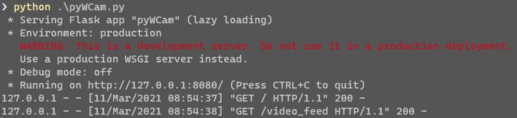
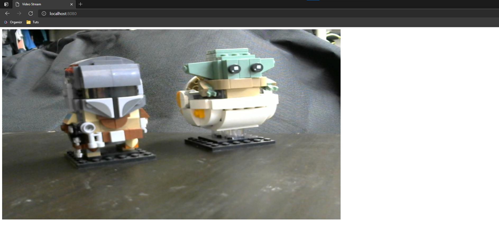
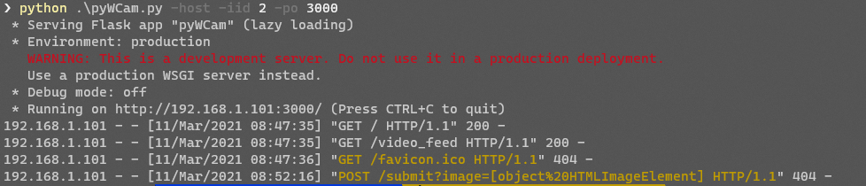
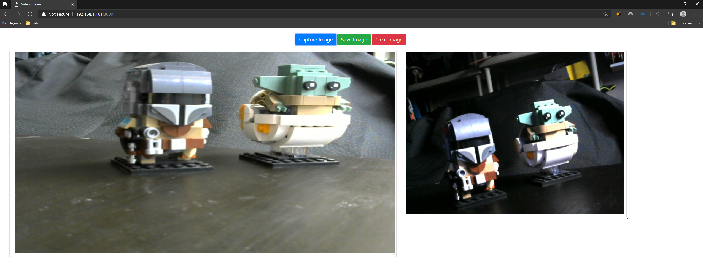

## pyWCam
------------
### About
for self hosting a webcam on a local webpage,
With the ability to Self host the page any on the local lan to access.

### How to setup
1. Clone the Repo
```
git clone https://github.com/DasCondor/pyWCam.git
```
2. Move into the Directory
```
cd /pyWCam
```
3. Install needed packages
```
pip install -r requirements.txt
```


### How to use

* Example 1:
```
python ./pyWCam.py # --HTMLIndexID 1 By Default
```

  *  Only Open to the single computer
  *  The System's Default WebCam on Port 8080
  *  With w1278 x h720 VideoStream
  *  http://127.0.0.1:8080


* Example 2:
```  
python ./pyWCam.py -host -po 3000 -iid 2
```

  *  Publishing for all to see,in the local lan
  *  The System's Default WebCam on Port 3000
  *  With Photo Capture System, that will save to jpg
     *  Note: Picture Window is resizeable
  *  http://$(YOUR_IP_ADDRESS):3000  
     *  or Port 8080, if not otherwise specified 


### Known Working OS
* There might be issues with some, please branch it
* Windows 10 Pro
* Raspberry Pi
* Ubuntu Server

#### Creds
* Thank you to Alfren for putting together the HTML Templates


### TODO
* Build Out Setup.py
* Correct any grammatical errors
* Add IP Camera support for at least RSTP
* Dockerize!!!

